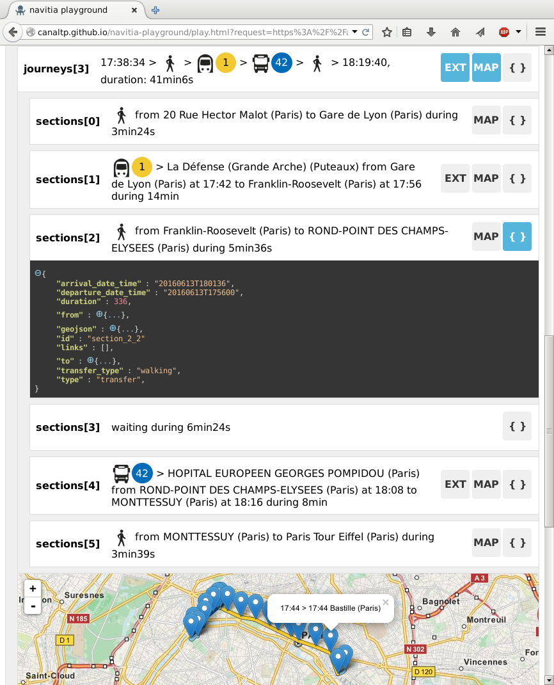

#  

Web UI for the [navitia](https://github.com/CanalTP/navitia) API. You can get a token [here](http://www.navitia.io) and then use this UI [here](https://canaltp.github.io/navitia-playground/).

## Screenshots

 

## Setting your dev environment to contribute

Installing the dependencies:
* Check first your node version with `node --version` and get a recent version if needed (should work with node 4.4 and 6.0). [Ubuntu/Debian installation](https://nodejs.org/en/download/package-manager/#debian-and-ubuntu-based-linux-distributions).
* `sudo npm install gulp -g && sudo npm install bower -g && npm install && bower install`

To launch:
* `gulp dev`

## License

This project is under the [MIT license](LICENSE). See the [bower file](bower.json) for the running dependencies and the [npm file](package.json) for dev dependencies.
